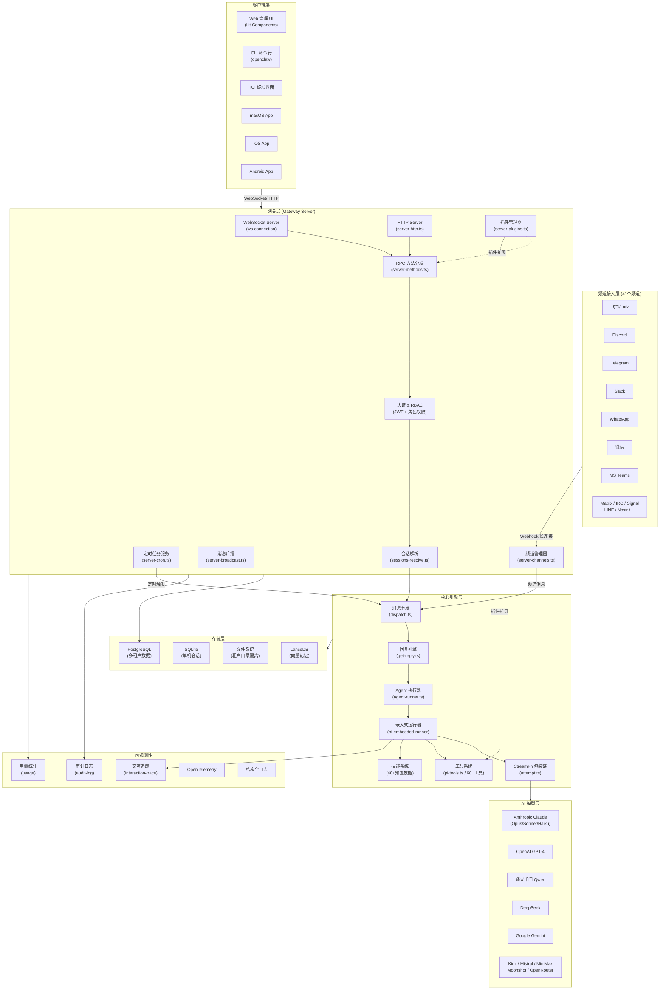
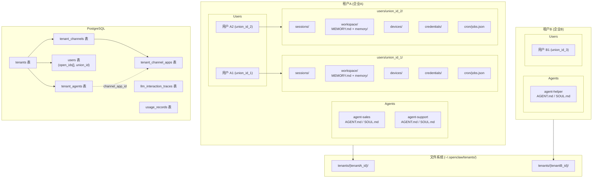
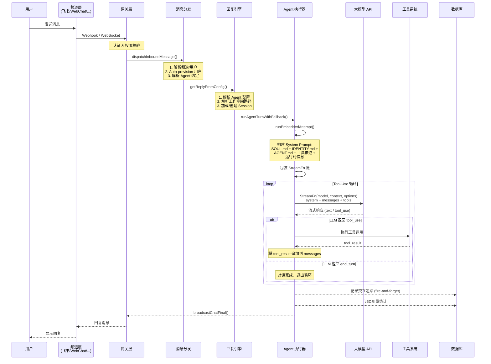
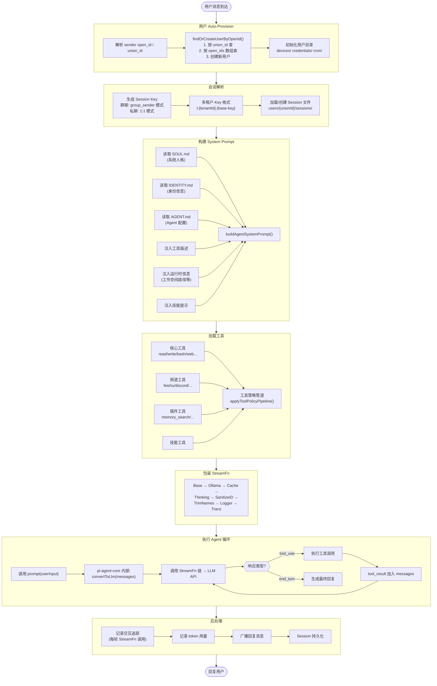
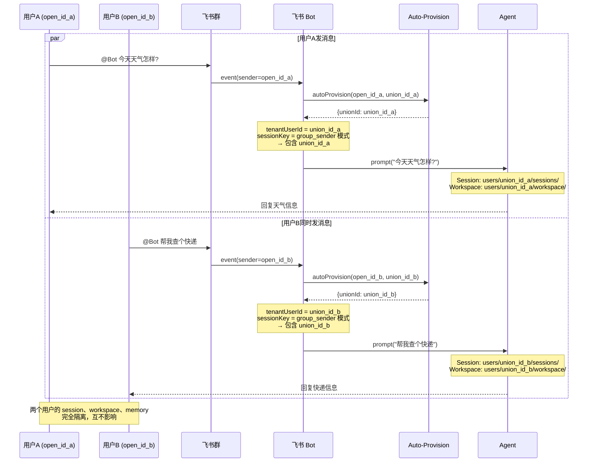
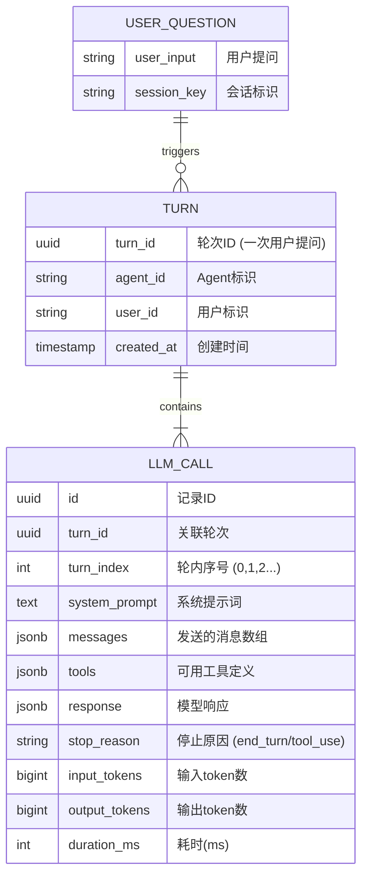
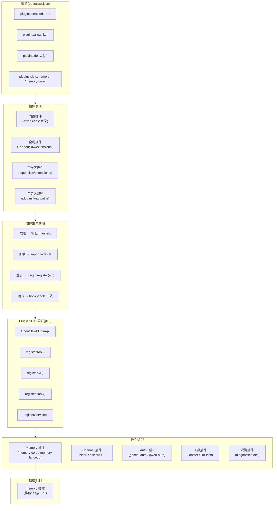
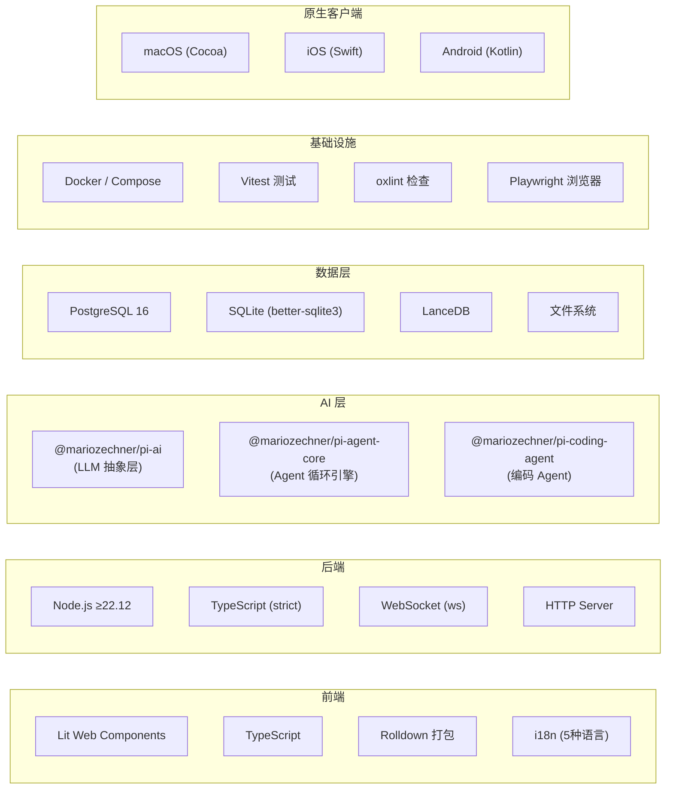

# OpenClaw 系统架构

## 一、系统总体架构



## 二、多租户数据隔离架构



**目录结构：**
```
~/.openclaw/tenants/{tenantId}/
├── SOUL.md / TOOLS.md / MEMORY.md          # 租户级配置
├── agents/{agentId}/                        # Agent 配置（无状态，共享）
│   ├── AGENT.md / SOUL.md / IDENTITY.md
│   ├── HEARTBEAT.md / BOOTSTRAP.md
│   └── skills/{skillName}/SKILL.md
├── skills/{skillName}/SKILL.md              # 租户级技能
└── users/{unionId}/                         # 用户级（完全隔离）
    ├── USER.md
    ├── sessions/  (sessions.json + {sessionId}.jsonl)
    ├── workspace/ (MEMORY.md + memory/)
    ├── devices/
    ├── credentials/
    └── cron/jobs.json
```

## 三、消息处理核心流程



## 四、StreamFn 包装链（由内到外）

```mermaid
graph LR
    subgraph Chain["StreamFn 包装链 (attempt.ts)"]
        direction LR
        Base["① Base StreamFn<br/><small>streamSimple / Ollama /<br/>DeepSeek / Qwen / OpenAI WS</small>"]
        Ollama["② Ollama NumCtx<br/><small>上下文窗口控制</small>"]
        Cache["③ Cache Trace<br/><small>缓存行为追踪</small>"]
        Think["④ Drop Thinking<br/><small>清理思考块</small>"]
        SanID["⑤ Sanitize Tool IDs<br/><small>工具调用ID规范化</small>"]
        Trim["⑥ Trim Tool Names<br/><small>工具名长度截断</small>"]
        AntLog["⑦ Anthropic Logger<br/><small>API 请求日志</small>"]
        Trace["⑧ Interaction Trace<br/><small>交互追踪记录</small>"]
    end

    LLM["大模型 API"] --> Base
    Base --> Ollama --> Cache --> Think --> SanID --> Trim --> AntLog --> Trace
    Trace --> AgentLoop["Agent Loop<br/>(pi-agent-core)"]

    style Trace fill:#e1f5fe,stroke:#0288d1,stroke-width:2px
    style Base fill:#fff3e0,stroke:#ef6c00,stroke-width:2px
```



**数据流向：Agent Loop 调用最外层 (⑧)，逐层传递到最内层 (①) 发送到 LLM API；响应从 ① 原路返回。每一层可以拦截/修改请求和响应。**

## 五、Agent 执行详细流程



## 六、群聊并发隔离流程



## 七、LLM 交互追踪数据模型



**示例：用户问"帮我搜下北京天气"触发 3 次 LLM 调用**

| turn_index | stop_reason | 说明 |
|:---:|:---:|------|
| 0 | tool_use | LLM 决定调用 web_search 工具 |
| 1 | tool_use | LLM 决定调用 web_fetch 抓取详情 |
| 2 | end_turn | LLM 生成最终回复 |

## 八、插件系统架构



## 九、技术栈总览


